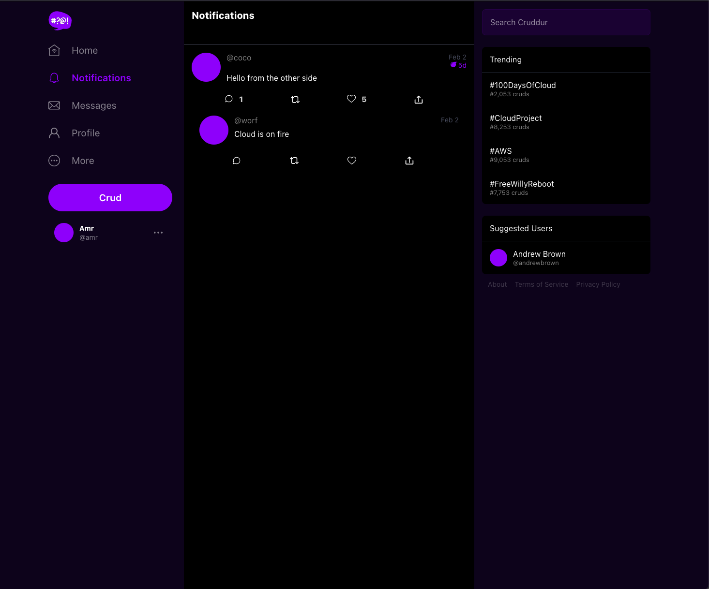
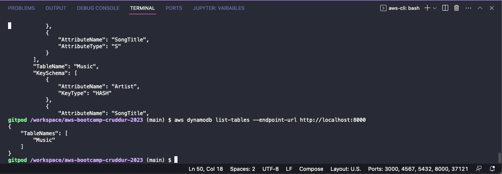
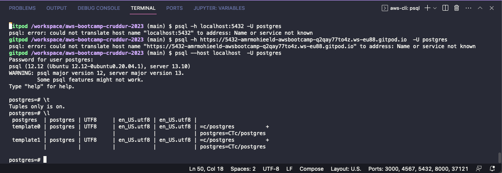

# Week 1 — App Containerization

- Containrized front-end and back-end 
- created Dockerfiles
- created docker-compose.yml
- Cloned the repo and deployed the application on my local machine. Got into some challenges with CORS and front-end backend communincations but managed to get it working at the end.
- Tried to configure external network on my local deployment but learnt that it is not possible on MACOS.
- Added Backend endpoint for Notifications
- Added endpoint documentaion in openapi yml
- Created the corresponding frontend page for notifications

- created local dynamodb container and tested it

- Created postgres container and installed psql into gitpod environment and tested connectivtiy.

