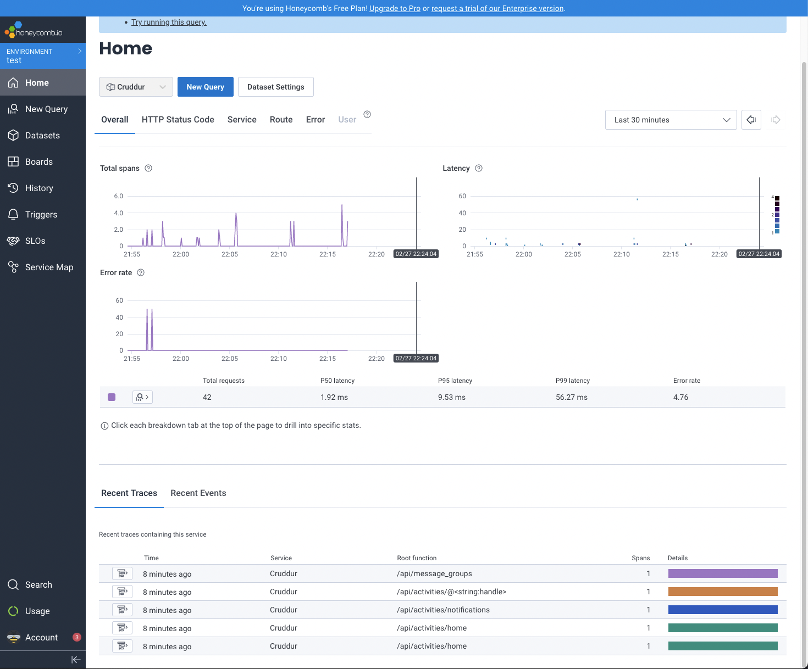
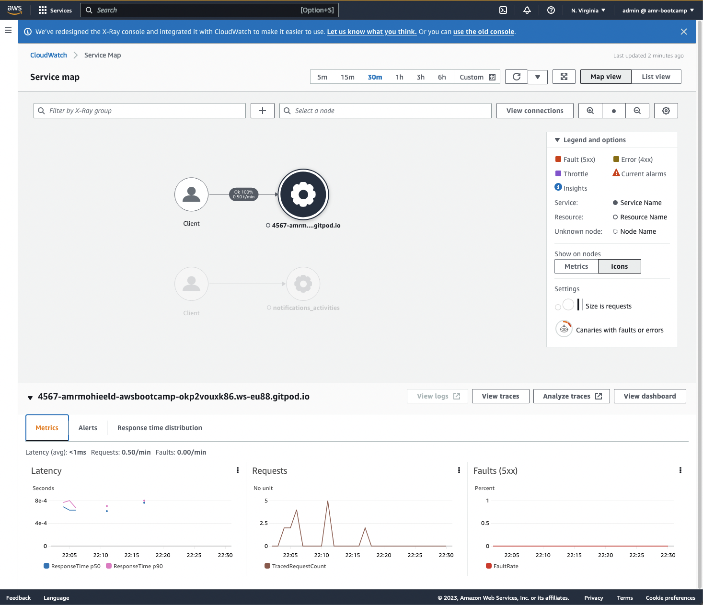
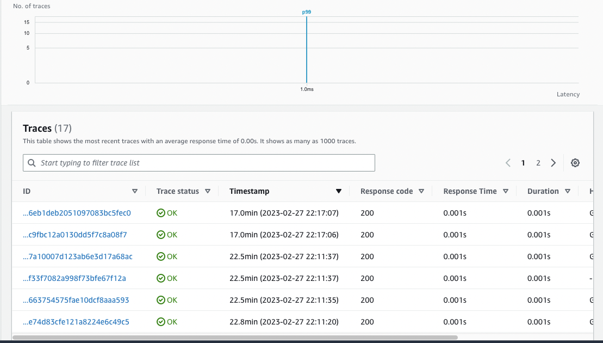

# Week 2 — Distributed Tracing

Learnt the concept of tracing for webapps and tried diffrent solutions to achieve this in Crudder.

## Honeycomb

- Configured honeycomb with open telementary to generate traces for the backend requests.
- 

---
## AWS X-ray
Configured tracing using AWS X-ray and created a segment for the notifications_activities endpoint
### Service Maps

### Traces

